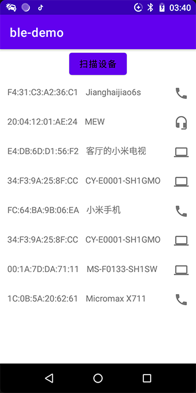
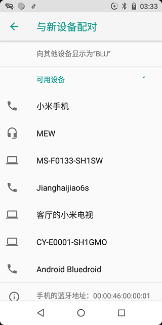

# Android 扫描蓝牙设备并获取设备类型

目前流行的蓝牙4.0标准包括传统的蓝牙(BT)和低功耗蓝牙模块(BLE)。

这里扫描的是传统蓝牙模块，先给出扫描结果：



### 一，扫描

Android扫描蓝牙设备是通过`BluetoothAdapter`启动蓝牙搜索，然后通过广播接收扫描的结果，其主要代码如下：

1，获取BluetoothAdapter

可通过单例模式直接获取
```
val btAdapt = BluetoothAdapter.getDefaultAdapter()
```

2，开始扫描

```
if (!btAdapt.isDiscovering) {
    it.startDiscovery()
}
```

3,注册广播

```
val intent = IntentFilter()
intent.apply {
    addAction(BluetoothDevice.ACTION_FOUND)
    addAction(BluetoothAdapter.ACTION_DISCOVERY_STARTED)
    addAction(BluetoothAdapter.ACTION_DISCOVERY_FINISHED)
    addAction(BluetoothAdapter.ACTION_STATE_CHANGED)
    priority = IntentFilter.SYSTEM_HIGH_PRIORITY
}
registerReceiver(searchDevices, intent)

private val searchDevices: BroadcastReceiver = object : BroadcastReceiver() {
    override fun onReceive(context: Context, intent: Intent) {
        when (intent.action) {
            BluetoothAdapter.ACTION_STATE_CHANGED -> {
                LogUtil.LOGE("ACTION_STATE_CHANGED")
            }
            BluetoothDevice.ACTION_FOUND -> { //found device
                val device =
                    intent.getParcelableExtra<BluetoothDevice>(BluetoothDevice.EXTRA_DEVICE)
                if (!device.name.isNullOrEmpty()) {
                    // 得到设备对象
                    mData.add(device)
                    adapter.notifyDataSetChanged()
                }
            }
            BluetoothAdapter.ACTION_DISCOVERY_STARTED -> {
                ToastUtil.show("正在扫描")
            }
            BluetoothAdapter.ACTION_DISCOVERY_FINISHED -> {
                ToastUtil.show("扫描完成，点击列表中的设备来尝试连接")
            }
        }
    }
}
```
拿到设备对象后即可在列表中展示，最后别忘了取消注册广播

### 二，获取蓝牙设备类型

上面获取到的设备对象`BluetoothDevice` 有 `device.getType()`方法。查看源码可知，该方法返回的类型有
```
/**
 * Bluetooth device type, Unknown   未知类型
 */
public static final int DEVICE_TYPE_UNKNOWN = 0;

/**
 * Bluetooth device type, Classic - BR/EDR devices  传统类型
 */
public static final int DEVICE_TYPE_CLASSIC = 1;

/**
 * Bluetooth device type, Low Energy - LE-only      ble类型
 */
public static final int DEVICE_TYPE_LE = 2;

/**
 * Bluetooth device type, Dual Mode - BR/EDR/LE     传统和ble双重类型
 */
public static final int DEVICE_TYPE_DUAL = 3;
```
我们来看一下手机自带的蓝牙扫描到的结果：



把`device.getType()`方法返回值和上面的做对比，可以发现该方法无法区分设备是手机类型，电脑类型还是耳机类型。

那么Android系统是如何区分的呢？

命令行下输入如下命令：
```
adb shell dumpsys window | findstr mCurrentFocus
```
查看手机系统自带的蓝牙扫描界面结果如下：
```
mCurrentFocus=Window{43e2635 u0 com.android.settings/com.android.settings.Settings$BluetoothSettingsActivity}
```
因此查看android源码找到`BluetoothSettingsActivity`即可查看其如何实现，这里源码就不做深究，获取类型方式如下：

```
// 获取类型对应的图标资源
int deviceTypeImg = BtUtil.getDeviceType(device.getBluetoothClass());
holder.ivType.setImageResource(deviceTypeImg);
```
用到的工具类是下系统源码基础上做了修改，代码如下：
```
public class BtUtil {
    public static final int PROFILE_HEADSET = 0;

    public static final int PROFILE_A2DP = 1;

    public static final int PROFILE_OPP = 2;

    public static final int PROFILE_HID = 3;

    public static final int PROFILE_PANU = 4;

    public static final int PROFILE_NAP = 5;

    public static final int PROFILE_A2DP_SINK = 6;

    public static int getDeviceType(BluetoothClass bluetoothClass) {
        if (bluetoothClass == null) {
            return R.drawable.ic_settings_bluetooth;
        }
        switch (bluetoothClass.getMajorDeviceClass()) {
            case BluetoothClass.Device.Major.COMPUTER:
                return R.drawable.ic_bt_laptop;
            case BluetoothClass.Device.Major.PHONE:
                return R.drawable.ic_bt_cellphone;
            case BluetoothClass.Device.Major.PERIPHERAL:
                return R.drawable.ic_bt_misc_hid;
            case BluetoothClass.Device.Major.IMAGING:
                return R.drawable.ic_bt_imaging;
            default:
                if (BtUtil.doesClassMatch(bluetoothClass, PROFILE_HEADSET))
                    return R.drawable.ic_bt_headset_hfp;
                else if (BtUtil.doesClassMatch(bluetoothClass, PROFILE_A2DP)) {
                    return R.drawable.ic_bt_headphones_a2dp;
                } else {
                    return R.drawable.ic_settings_bluetooth;
                }
        }
    }

    public static boolean doesClassMatch(BluetoothClass bluetoothClass, int profile) {
        if (profile == PROFILE_A2DP) {
            if (bluetoothClass.hasService(BluetoothClass.Service.RENDER)) {
                return true;
            }
            // By the A2DP spec, sinks must indicate the RENDER service.
            // However we found some that do not (Chordette). So lets also
            // match on some other class bits.
            switch (bluetoothClass.getDeviceClass()) {
                case BluetoothClass.Device.AUDIO_VIDEO_HIFI_AUDIO:
                case BluetoothClass.Device.AUDIO_VIDEO_HEADPHONES:
                case BluetoothClass.Device.AUDIO_VIDEO_LOUDSPEAKER:
                case BluetoothClass.Device.AUDIO_VIDEO_CAR_AUDIO:
                    return true;
                default:
                    return false;
            }
        } else if (profile == PROFILE_A2DP_SINK) {
            if (bluetoothClass.hasService(BluetoothClass.Service.CAPTURE)) {
                return true;
            }
            // By the A2DP spec, srcs must indicate the CAPTURE service.
            // However if some device that do not, we try to
            // match on some other class bits.
            switch (bluetoothClass.getDeviceClass()) {
                case BluetoothClass.Device.AUDIO_VIDEO_HIFI_AUDIO:
                case BluetoothClass.Device.AUDIO_VIDEO_SET_TOP_BOX:
                case BluetoothClass.Device.AUDIO_VIDEO_VCR:
                    return true;
                default:
                    return false;
            }
        } else if (profile == PROFILE_HEADSET) {
            // The render service class is required by the spec for HFP, so is a
            // pretty good signal
            if (bluetoothClass.hasService(BluetoothClass.Service.RENDER)) {
                return true;
            }
            // Just in case they forgot the render service class
            switch (bluetoothClass.getDeviceClass()) {
                case BluetoothClass.Device.AUDIO_VIDEO_HANDSFREE:
                case BluetoothClass.Device.AUDIO_VIDEO_WEARABLE_HEADSET:
                case BluetoothClass.Device.AUDIO_VIDEO_CAR_AUDIO:
                    return true;
                default:
                    return false;
            }
        } else if (profile == PROFILE_OPP) {
            if (bluetoothClass.hasService(BluetoothClass.Service.OBJECT_TRANSFER)) {
                return true;
            }

            switch (bluetoothClass.getDeviceClass()) {
                case BluetoothClass.Device.COMPUTER_UNCATEGORIZED:
                case BluetoothClass.Device.COMPUTER_DESKTOP:
                case BluetoothClass.Device.COMPUTER_SERVER:
                case BluetoothClass.Device.COMPUTER_LAPTOP:
                case BluetoothClass.Device.COMPUTER_HANDHELD_PC_PDA:
                case BluetoothClass.Device.COMPUTER_PALM_SIZE_PC_PDA:
                case BluetoothClass.Device.COMPUTER_WEARABLE:
                case BluetoothClass.Device.PHONE_UNCATEGORIZED:
                case BluetoothClass.Device.PHONE_CELLULAR:
                case BluetoothClass.Device.PHONE_CORDLESS:
                case BluetoothClass.Device.PHONE_SMART:
                case BluetoothClass.Device.PHONE_MODEM_OR_GATEWAY:
                case BluetoothClass.Device.PHONE_ISDN:
                    return true;
                default:
                    return false;
            }
        } else if (profile == PROFILE_HID) {
            return (bluetoothClass.getDeviceClass() & BluetoothClass.Device.Major.PERIPHERAL) == BluetoothClass.Device.Major.PERIPHERAL;
        } else if (profile == PROFILE_PANU || profile == PROFILE_NAP) {
            // No good way to distinguish between the two, based on class bits.
            if (bluetoothClass.hasService(BluetoothClass.Service.NETWORKING)) {
                return true;
            }
            return (bluetoothClass.getDeviceClass() & BluetoothClass.Device.Major.NETWORKING) == BluetoothClass.Device.Major.NETWORKING;
        } else {
            return false;
        }
    }
}
```
最终实现效果如下图：


### 三，gatt

todo comm with ble by gatt

